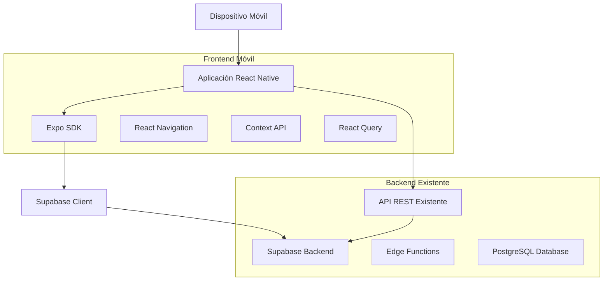
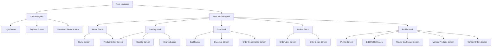
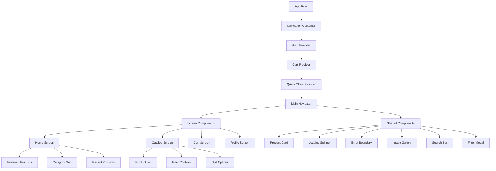
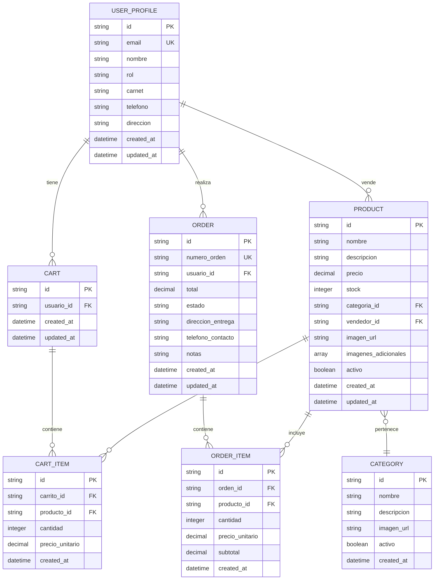

# Documento de Arquitectura Técnica - Unimarket Móvil

## 1. Diseño de Arquitectura

### 1.1 Arquitectura General del Sistema



### 1.2 Stack Tecnológico

**Framework Principal:**
- React Native 0.72+ con Expo SDK 49+
- TypeScript para type safety completo
- React Navigation 6 para navegación nativa

**Estado y Gestión de Datos:**
- Context API para estado global (auth, cart)
- React Query (TanStack Query) para cache y sincronización de datos
- Zustand como alternativa para estado complejo si es necesario
- AsyncStorage para persistencia local

**UI y Estilos:**
- React Native Paper (Material Design 3)
- Styled Components o NativeWind para estilos
- React Native Reanimated 3 para animaciones avanzadas
- Lottie para animaciones complejas

**Servicios y Utilidades:**
- Expo SDK para servicios nativos (cámara, notificaciones, etc.)
- React Native Firebase para push notifications
- Sentry para error tracking y performance monitoring
- React Native Image Picker para gestión de imágenes

## 2. Descripción de Tecnologías

### 2.1 Frontend Móvil
- **React Native + Expo**: Desarrollo cross-platform con acceso a APIs nativas
- **TypeScript**: Type safety y mejor desarrollador experience
- **React Navigation**: Navegación nativa con stack, tabs y drawers
- **React Query**: Cache inteligente, sincronización automática, offline-first
- **Expo SDK**: Acceso a funcionalidades nativas sin ejectuar

### 2.2 Herramientas de Desarrollo
- **Expo CLI**: Herramientas de desarrollo y build
- **Expo Go**: Aplicación para desarrollo y testing rápido
- **React Native Debugger**: Debugging avanzado
- **Flipper**: Inspección de red, estado, y performance

### 2.3 Servicios Backend
- **Supabase**: Backend existente con autenticación, base de datos, storage
- **Edge Functions**: Funciones serverless existentes para lógica de negocio
- **Storage**: Almacenamiento de imágenes de productos
- **Realtime**: Suscripciones a cambios en tiempo real

### 2.4 Testing y Calidad
- **Jest**: Unit testing
- **React Native Testing Library**: Testing de componentes
- **Detox**: E2E testing
- **ESLint + Prettier**: Linting y formateo de código

## 3. Definición de Rutas y Navegación

### 3.1 Estructura de Navegación Principal



### 3.2 Rutas de la Aplicación

| Ruta | Pantalla | Propósito |
|-------|----------|-----------|
| **Auth Navigator** | | |
| `/auth/login` | LoginScreen | Autenticación de usuarios |
| `/auth/register` | RegisterScreen | Registro de nuevos usuarios |
| `/auth/reset-password` | ResetPasswordScreen | Recuperación de contraseña |
| **Main Tab Navigator** | | |
| `/` | HomeStack | Navegación principal |
| `/catalog` | CatalogStack | Exploración de productos |
| `/cart` | CartStack | Gestión del carrito |
| `/orders` | OrdersStack | Historial de órdenes |
| `/profile` | ProfileStack | Perfil y configuración |
| **Home Stack** | | |
| `/home` | HomeScreen | Pantalla principal con destacados |
| `/product/:id` | ProductDetailScreen | Detalle de producto |
| **Catalog Stack** | | |
| `/catalog` | CatalogScreen | Lista de productos con filtros |
| `/search` | SearchScreen | Búsqueda avanzada |
| `/category/:id` | CategoryScreen | Productos por categoría |
| **Cart Stack** | | |
| `/cart` | CartScreen | Vista del carrito |
| `/checkout` | CheckoutScreen | Proceso de pago |
| `/order-confirmation` | OrderConfirmationScreen | Confirmación de orden |
| **Orders Stack** | | |
| `/orders` | OrdersListScreen | Lista de órdenes del usuario |
| `/order/:id` | OrderDetailScreen | Detalle de orden específica |
| **Profile Stack** | | |
| `/profile` | ProfileScreen | Perfil de usuario |
| `/profile/edit` | EditProfileScreen | Edición de perfil |
| `/vendor/dashboard` | VendorDashboardScreen | Dashboard de vendedor |
| `/vendor/products` | VendorProductsScreen | Gestión de productos |
| `/vendor/orders` | VendorOrdersScreen | Órdenes de venta |

## 4. Definición de APIs y Servicios

### 4.1 Servicios de Autenticación

```typescript
// Auth Service Interface
interface AuthService {
  login(email: string, password: string): Promise<AuthResponse>
  register(data: RegisterData): Promise<AuthResponse>
  logout(): Promise<void>
  getCurrentUser(): Promise<UserProfile | null>
  updateProfile(data: UpdateProfileData): Promise<UserProfile>
  resetPassword(email: string): Promise<void>
}

// Auth Response Types
interface AuthResponse {
  user: UserProfile
  accessToken: string
  refreshToken: string
}

interface RegisterData {
  email: string
  password: string
  nombre: string
  carnet: string
  telefono?: string
  direccion?: string
  rol: 'estudiante' | 'vendedor'
}
```

### 4.2 Servicios de Productos

```typescript
// Products Service Interface
interface ProductsService {
  getProducts(filters: ProductFilters): Promise<PaginatedProducts>
  getProductById(id: string): Promise<Product>
  searchProducts(query: string): Promise<Product[]>
  getProductsByCategory(categoryId: string): Promise<Product[]>
  getVendorProducts(vendorId: string): Promise<Product[]>
  createProduct(data: CreateProductData): Promise<Product>
  updateProduct(id: string, data: UpdateProductData): Promise<Product>
  deleteProduct(id: string): Promise<void>
}

// Product Types
interface ProductFilters {
  category?: string
  search?: string
  sort?: 'reciente' | 'precio_asc' | 'precio_desc' | 'nombre'
  limit?: number
  offset?: number
}

interface CreateProductData {
  nombre: string
  descripcion?: string
  precio: number
  stock: number
  categoria_id: string
  imagen_url?: string
  imagenes_adicionales?: string[]
}
```

### 4.3 Servicios de Carrito

```typescript
// Cart Service Interface
interface CartService {
  getCart(): Promise<CartResponse>
  addToCart(productId: string, quantity: number): Promise<CartItem>
  updateCartItem(itemId: string, quantity: number): Promise<CartItem>
  removeCartItem(itemId: string): Promise<void>
  clearCart(): Promise<void>
}

// Cart Types
interface CartResponse {
  cartId: string
  items: CartItem[]
  total: number
  itemCount: number
}

interface CartItem {
  id: string
  producto_id: string
  cantidad: number
  precio_unitario: number
  producto: Product
}
```

### 4.4 Servicios de Órdenes

```typescript
// Orders Service Interface
interface OrdersService {
  getOrders(): Promise<Order[]>
  getOrderById(id: string): Promise<Order>
  createOrder(data: CreateOrderData): Promise<Order>
  updateOrderStatus(id: string, status: OrderStatus): Promise<Order>
  getVendorOrders(): Promise<Order[]>
}

// Order Types
interface CreateOrderData {
  direccion_entrega: string
  telefono_contacto: string
  notas?: string
}

type OrderStatus = 'pendiente' | 'confirmada' | 'enviada' | 'entregada' | 'cancelada'
```

## 5. Arquitectura de Componentes

### 5.1 Estructura de Componentes



### 5.2 Componentes Principales

**Componentes de Navegación:**
- `BottomTabNavigator`: Navegación principal por tabs
- `StackNavigator`: Navegación en pila para flujos profundos
- `DrawerNavigator`: Menú lateral para opciones adicionales

**Componentes de UI:**
- `ProductCard`: Tarjeta de producto con imagen, precio, rating
- `CartItem`: Item del carrito con controles de cantidad
- `OrderCard`: Tarjeta de resumen de orden
- `SearchBar`: Barra de búsqueda con sugerencias
- `FilterModal`: Modal de filtros con múltiples opciones
- `ImageGallery`: Galería de imágenes con zoom

**Componentes de Layout:**
- `ScreenContainer`: Contenedor base con safe areas
- `Header`: Header personalizable con título y acciones
- `LoadingView`: Vista de carga con skeletons
- `ErrorView`: Vista de error con retry
- `EmptyView`: Vista para listas vacías

## 6. Modelo de Datos

### 6.1 Diagrama de Entidades



### 6.2 Definición de Tablas (DDL)

```sql
-- Tabla de perfiles de usuario (existente)
CREATE TABLE user_profiles (
    id UUID PRIMARY KEY DEFAULT gen_random_uuid(),
    email VARCHAR(255) UNIQUE NOT NULL,
    nombre VARCHAR(100) NOT NULL,
    rol VARCHAR(20) DEFAULT 'estudiante' CHECK (rol IN ('estudiante', 'vendedor', 'admin')),
    carnet VARCHAR(20) UNIQUE,
    telefono VARCHAR(20),
    direccion TEXT,
    created_at TIMESTAMP WITH TIME ZONE DEFAULT NOW(),
    updated_at TIMESTAMP WITH TIME ZONE DEFAULT NOW()
);

-- Tabla de categorías (existente)
CREATE TABLE categories (
    id UUID PRIMARY KEY DEFAULT gen_random_uuid(),
    nombre VARCHAR(100) NOT NULL,
    descripcion TEXT,
    imagen_url TEXT,
    activo BOOLEAN DEFAULT true,
    created_at TIMESTAMP WITH TIME ZONE DEFAULT NOW()
);

-- Tabla de productos (existente)
CREATE TABLE products (
    id UUID PRIMARY KEY DEFAULT gen_random_uuid(),
    nombre VARCHAR(200) NOT NULL,
    descripcion TEXT,
    precio DECIMAL(10,2) NOT NULL CHECK (precio >= 0),
    stock INTEGER NOT NULL CHECK (stock >= 0),
    categoria_id UUID REFERENCES categories(id),
    vendedor_id UUID REFERENCES user_profiles(id),
    imagen_url TEXT,
    imagenes_adicionales TEXT[],
    activo BOOLEAN DEFAULT true,
    created_at TIMESTAMP WITH TIME ZONE DEFAULT NOW(),
    updated_at TIMESTAMP WITH TIME ZONE DEFAULT NOW()
);

-- Tabla de carritos (existente)
CREATE TABLE carts (
    id UUID PRIMARY KEY DEFAULT gen_random_uuid(),
    usuario_id UUID REFERENCES user_profiles(id),
    created_at TIMESTAMP WITH TIME ZONE DEFAULT NOW(),
    updated_at TIMESTAMP WITH TIME ZONE DEFAULT NOW()
);

-- Tabla de items del carrito (existente)
CREATE TABLE cart_items (
    id UUID PRIMARY KEY DEFAULT gen_random_uuid(),
    carrito_id UUID REFERENCES carts(id) ON DELETE CASCADE,
    producto_id UUID REFERENCES products(id),
    cantidad INTEGER NOT NULL CHECK (cantidad > 0),
    precio_unitario DECIMAL(10,2) NOT NULL,
    created_at TIMESTAMP WITH TIME ZONE DEFAULT NOW(),
    UNIQUE(carrito_id, producto_id)
);

-- Tabla de órdenes (existente)
CREATE TABLE orders (
    id UUID PRIMARY KEY DEFAULT gen_random_uuid(),
    numero_orden VARCHAR(50) UNIQUE NOT NULL,
    usuario_id UUID REFERENCES user_profiles(id),
    total DECIMAL(10,2) NOT NULL,
    estado VARCHAR(20) DEFAULT 'pendiente' CHECK (estado IN ('pendiente', 'confirmada', 'enviada', 'entregada', 'cancelada')),
    direccion_entrega TEXT NOT NULL,
    telefono_contacto VARCHAR(20) NOT NULL,
    notas TEXT,
    created_at TIMESTAMP WITH TIME ZONE DEFAULT NOW(),
    updated_at TIMESTAMP WITH TIME ZONE DEFAULT NOW()
);

-- Tabla de items de órdenes (existente)
CREATE TABLE order_items (
    id UUID PRIMARY KEY DEFAULT gen_random_uuid(),
    orden_id UUID REFERENCES orders(id) ON DELETE CASCADE,
    producto_id UUID REFERENCES products(id),
    cantidad INTEGER NOT NULL CHECK (cantidad > 0),
    precio_unitario DECIMAL(10,2) NOT NULL,
    subtotal DECIMAL(10,2) NOT NULL,
    created_at TIMESTAMP WITH TIME ZONE DEFAULT NOW()
);
```

### 6.3 Índices y Optimización

```sql
-- Índices para búsquedas frecuentes
CREATE INDEX idx_products_activo ON products(activo);
CREATE INDEX idx_products_categoria ON products(categoria_id);
CREATE INDEX idx_products_vendedor ON products(vendedor_id);
CREATE INDEX idx_products_precio ON products(precio);
CREATE INDEX idx_products_nombre ON products(nombre);

-- Índices para carritos y órdenes
CREATE INDEX idx_carts_usuario ON carts(usuario_id);
CREATE INDEX idx_cart_items_carrito ON cart_items(carrito_id);
CREATE INDEX idx_cart_items_producto ON cart_items(producto_id);
CREATE INDEX idx_orders_usuario ON orders(usuario_id);
CREATE INDEX idx_orders_estado ON orders(estado);
CREATE INDEX idx_orders_created_at ON orders(created_at DESC);
CREATE INDEX idx_order_items_orden ON order_items(orden_id);

-- Índices para búsqueda de texto
CREATE INDEX idx_products_search ON products USING gin(to_tsvector('spanish', nombre || ' ' || COALESCE(descripcion, '')));
```

## 7. Seguridad y Permisos (RLS)

### 7.1 Políticas de Seguridad

```sql
-- Políticas para user_profiles
ALTER TABLE user_profiles ENABLE ROW LEVEL SECURITY;

-- Permitir lectura a usuarios autenticados
CREATE POLICY "Users can view profiles" ON user_profiles
    FOR SELECT TO authenticated
    USING (true);

-- Permitir actualización propia
CREATE POLICY "Users can update own profile" ON user_profiles
    FOR UPDATE TO authenticated
    USING (auth.uid() = id)
    WITH CHECK (auth.uid() = id);

-- Políticas para products
ALTER TABLE products ENABLE ROW LEVEL SECURITY;

-- Permitir lectura de productos activos
CREATE POLICY "Anyone can view active products" ON products
    FOR SELECT TO anon, authenticated
    USING (activo = true);

-- Permitir CRUD a vendedores propios
CREATE POLICY "Vendors can manage own products" ON products
    FOR ALL TO authenticated
    USING (
        auth.uid() = vendedor_id OR 
        EXISTS (
            SELECT 1 FROM user_profiles 
            WHERE id = auth.uid() AND rol = 'admin'
        )
    );

-- Políticas para carts
ALTER TABLE carts ENABLE ROW LEVEL SECURITY;

-- Permitir gestión propia del carrito
CREATE POLICY "Users can manage own cart" ON carts
    FOR ALL TO authenticated
    USING (auth.uid() = usuario_id)
    WITH CHECK (auth.uid() = usuario_id);

-- Políticas para orders
ALTER TABLE orders ENABLE ROW LEVEL SECURITY;

-- Permitir lectura de órdenes propias
CREATE POLICY "Users can view own orders" ON orders
    FOR SELECT TO authenticated
    USING (auth.uid() = usuario_id);

-- Permitir creación de órdenes autenticadas
CREATE POLICY "Authenticated users can create orders" ON orders
    FOR INSERT TO authenticated
    WITH CHECK (auth.uid() = usuario_id);
```

## 8. Configuración de Expo y Despliegue

### 8.1 Configuración de app.json

```json
{
  "expo": {
    "name": "Unimarket Móvil",
    "slug": "unimarket-mobile",
    "version": "1.0.0",
    "orientation": "portrait",
    "icon": "./assets/icon.png",
    "userInterfaceStyle": "light",
    "splash": {
      "image": "./assets/splash.png",
      "resizeMode": "contain",
      "backgroundColor": "#CC0000"
    },
    "assetBundlePatterns": [
      "**/*"
    ],
    "ios": {
      "supportsTablet": true,
      "bundleIdentifier": "com.univalle.unimarket"
    },
    "android": {
      "adaptiveIcon": {
        "foregroundImage": "./assets/adaptive-icon.png",
        "backgroundColor": "#CC0000"
      },
      "package": "com.univalle.unimarket"
    },
    "web": {
      "favicon": "./assets/favicon.png"
    },
    "plugins": [
      "expo-secure-store",
      "expo-image-picker",
      "expo-notifications"
    ],
    "extra": {
      "supabaseUrl": "YOUR_SUPABASE_URL",
      "supabaseAnonKey": "YOUR_SUPABASE_ANON_KEY"
    }
  }
}
```

### 8.2 Variables de Entorno

```typescript
// .env
EXPO_PUBLIC_SUPABASE_URL=https://your-project.supabase.co
EXPO_PUBLIC_SUPABASE_ANON_KEY=your-anon-key
EXPO_PUBLIC_API_URL=https://your-project.supabase.co/functions/v1

EXPO_PUBLIC_SENTRY_DSN=your-sentry-dsn
EXPO_PUBLIC_APP_VERSION=1.0.0
EXPO_PUBLIC_APP_ENV=production
```

### 8.3 Proceso de Build

```bash
# Instalación de dependencias
npm install

# Desarrollo
npm run start

# Build para iOS
npm run build:ios

# Build para Android
npm run build:android

# Build para ambas plataformas
npm run build:all

# Submissions a tiendas
npm run submit:ios
npm run submit:android
```

## 9. Testing y Calidad

### 9.1 Estrategia de Testing

**Unit Tests:**
- Servicios y utilidades
- Custom hooks
- Lógica de negocio
- Validaciones

**Integration Tests:**
- Flujos de autenticación
- Flujos de compra
- Gestión de carrito
- Sincronización de datos

**E2E Tests:**
- Flujo completo de compra
- Flujo de registro y login
- Gestión de productos (vendedor)
- Navegación completa

### 9.2 Herramientas de Testing

```json
{
  "devDependencies": {
    "@testing-library/react-native": "^12.0.0",
    "@testing-library/jest-native": "^5.4.0",
    "jest": "^29.0.0",
    "jest-expo": "^49.0.0",
    "detox": "^20.0.0",
    "@types/jest": "^29.0.0"
  }
}
```

## 10. Monitoreo y Analytics

### 10.1 Error Tracking
- Sentry para crash reporting
- Captura de errores de JavaScript y nativos
- Performance monitoring
- User feedback

### 10.2 Analytics
- Mixpanel o Amplitude para event tracking
- Firebase Analytics para métricas básicas
- Custom events para flujos de negocio
- Funnel analysis para conversión

### 10.3 Performance Monitoring
- React Native Performance
- Flipper para debugging
- Custom metrics para tiempos de carga
- Memory usage tracking