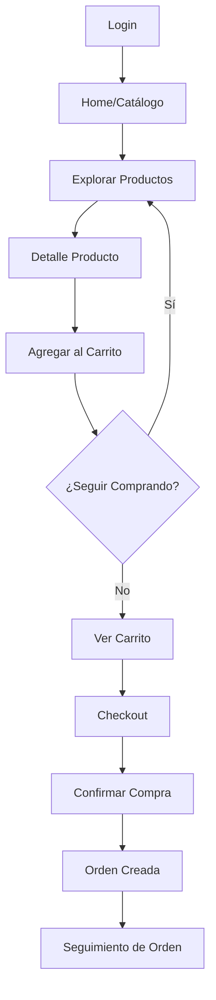
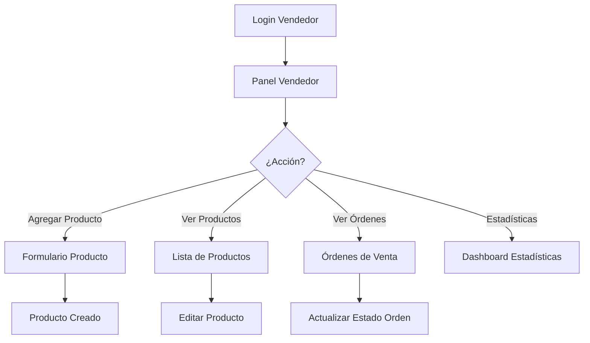
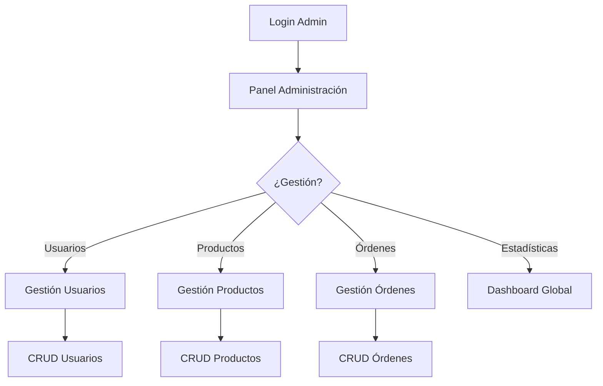

# Documento de Requisitos del Producto - Unimarket Móvil

## 1. Descripción General del Producto

Unimarket Móvil es la versión nativa para dispositivos móviles de la plataforma de comercio electrónico Unimarket, diseñada específicamente para estudiantes de la Universidad del Valle. La aplicación móvil replica completamente todas las funcionalidades de la versión web, adaptadas perfectamente para la experiencia táctil y móvil, manteniendo el diseño institucional formal de Univalle.

La aplicación permite a los estudiantes comprar y vender productos dentro del campus universitario de manera segura y eficiente, con autenticación institucional, gestión de carritos, procesamiento de órdenes y panel de administración para vendedores.

### Objetivo Principal

Proporcionar una experiencia móvil completa y optimizada que permita a los estudiantes acceder a todas las funcionalidades de Unimarket desde sus dispositivos móviles, con un diseño adaptado perfectamente a interfaces táctiles y navegación móvil.

### Usuarios Objetivo

* Estudiantes de la Universidad del Valle que desean comprar productos dentro del campus

* Estudiantes emprendedores que venden productos a sus compañeros

* Administradores del sistema que gestionan la plataforma

## 2. Funcionalidades Principales

### 2.1 Roles de Usuario

| Rol                  | Método de Registro                              | Permisos Principales                                                                       |
| -------------------- | ----------------------------------------------- | ------------------------------------------------------------------------------------------ |
| Estudiante Comprador | Email institucional + carnet universitario      | Explorar catálogo, agregar al carrito, realizar compras, gestionar perfil                  |
| Estudiante Vendedor  | Email institucional + carnet + solicitud de rol | Crear/editar productos, gestionar inventario, ver órdenes de venta, estadísticas de ventas |
| Administrador        | Designación institucional                       | Gestión completa de usuarios, productos, órdenes, estadísticas del sistema                 |

### 2.2 Módulos de Funcionalidades

La aplicación móvil Unimarket incluye los siguientes módulos esenciales:

1. **Autenticación**: Login/registro con email institucional, recuperación de contraseña, perfil de usuario
2. **Catálogo de Productos**: Exploración con filtros por categoría, búsqueda inteligente, vista de detalles
3. **Carrito de Compras**: Gestión de items, cálculo de totales, modificación de cantidades
4. **Gestión de Órdenes**: Historial de compras, seguimiento de estados, detalles de órdenes
5. **Panel de Vendedor**: Gestión de productos, inventario, órdenes de venta, estadísticas
6. **Perfil de Usuario**: Información personal, configuración, historial de actividad

### 2.3 Detalle de Páginas y Funcionalidades

| Página               | Módulo                      | Descripción de Funcionalidades                                                                                                                |
| -------------------- | --------------------------- | --------------------------------------------------------------------------------------------------------------------------------------------- |
| **Login/Registro**   | Formulario de autenticación | Iniciar sesión con email y contraseña, registro con email institucional, validación de carnet universitario, recuperación de contraseña       |
| **Home**             | Pantalla principal          | Banner con productos destacados, navegación rápida a categorías, productos recientes, acceso rápido al carrito y perfil                       |
| **Catálogo**         | Lista de productos          | Filtros por categoría, búsqueda por nombre/descripción, ordenamiento por precio y fecha, vista en grid adaptativo, paginación infinita        |
| **Detalle Producto** | Información del producto    | Imágenes con zoom táctil, descripción completa, precio y stock, botón de agregar al carrito, información del vendedor, productos relacionados |
| **Carrito**          | Gestión de compras          | Lista de productos seleccionados, modificación de cantidades, eliminación de items, cálculo de total, botón de checkout                       |
| **Checkout**         | Proceso de compra           | Formulario de dirección de entrega, selección de método de pago, resumen de orden, confirmación de compra                                     |
| **Mis Órdenes**      | Historial de compras        | Lista de órdenes con estados, filtro por estado, detalles de cada orden, información de seguimiento                                           |
| **Perfil**           | Gestión de cuenta           | Información personal editable, foto de perfil, configuración de notificaciones, cierre de sesión                                              |
| **Panel Vendedor**   | Gestión de ventas           | Dashboard con estadísticas, lista de productos propios, formulario de creación/edición de productos, gestión de inventario, órdenes de venta  |
| **Configuración**    | Preferencias de app         | Configuración de notificaciones, privacidad, idioma, ayuda y soporte                                                                          |

## 3. Flujos Principales de Usuario

### 3.1 Flujo de Compra (Estudiante Comprador)

### 3.2 Flujo de Venta (Estudiante Vendedor)

### 3.3 Flujo de Administrador

## 4. Diseño de Interfaz de Usuario

### 4.1 Estilo de Diseño

**Sistema de Colores Univalle:**

* **Color Primario**: #CC0000 (Rojo Univalle) - Botones principales, acciones importantes

* **Color Secundario**: #800040 (Borgoña) - Elementos institucionales, headers

* **Color de Fondo**: #FFFFFF - Fondos principales

* **Texto Principal**: #333333 - Texto de contenido

* **Texto Secundario**: #666666 - Textos auxiliares

* **Éxito**: #28A745 - Estados positivos

* **Advertencia**: #FFC107 - Alertas importantes

* **Error**: #DC3545 - Errores y validaciones

**Estilo de Componentes:**

* **Botones**: Estilo redondeado con sombra sutil, altura mínima 44px para accesibilidad táctil

* **Tarjetas**: Esquinas redondeadas, sombra moderada, efecto hover sutil

* **Tipografía**: Inter font family, jerarquía clara con tamaños responsive

* **Espaciado**: Sistema de espaciado de 8px, márgenes y padding generosos

* **Iconografía**: Iconos lineales modernos, consistentes con el sistema

**Animaciones y Transiciones:**

* Transiciones rápidas (150ms) para interacciones inmediatas

* Efectos de carga suaves para mejorar la percepción de rendimiento

* Animaciones de transición entre pantallas nativas de React Navigation

### 4.2 Diseño por Páginas

| Página               | Elementos de UI                                         | Especificaciones de Diseño                                                                       |
| -------------------- | ------------------------------------------------------- | ------------------------------------------------------------------------------------------------ |
| **Login**            | Logo Univalle, campos de entrada, botón principal       | Fondo blanco, logo centrado, campos con bordes redondeados, botón rojo prominente                |
| **Home**             | Banner carrusel, grid de categorías, lista de productos | Header con logo, navegación inferior, carrusel de promociones, grid de 2 columnas para productos |
| **Catálogo**         | Barra de búsqueda, filtros, grid de productos           | Búsqueda sticky en header, filtros desplegables, grid responsive de 2 columnas                   |
| **Detalle Producto** | Galería de imágenes, información, botón de acción       | Swipe horizontal para imágenes, información en tarjetas, botón flotante de acción                |
| **Carrito**          | Lista de items, resumen de totales, botón checkout      | Items en tarjetas con controles de cantidad, resumen sticky al final                             |
| **Panel Vendedor**   | Dashboard con métricas, lista de productos, acciones    | Cards de estadísticas, tabla/lista de productos, FAB para agregar producto                       |

### 4.3 Adaptabilidad y Responsive

**Mobile-First Design:**

* Diseño optimizado primero para dispositivos móviles

* Adaptación automática a diferentes tamaños de pantalla (iPhone SE a iPad Pro)

* Soporte para orientación portrait y landscape

* Optimización para notch y dynamic island de iPhone

**Consideraciones de Accesibilidad:**

* Tamaños de toque mínimos de 44x44px

* Contraste de color WCAG 2.1 AA

* Soporte para lectores de pantalla

* Navegación por voz cuando esté disponible

* Tamaños de fuente dinámicos del sistema

**Optimización para Touch:**

* Gestos de swipe para navegación

* Pull-to-refresh para actualizar contenido

* Long-press para acciones contextuales

* Pinch-to-zoom para imágenes de productos

### 4.4 Navegación Móvil

**Bottom Tab Navigation:**

* Inicio (icono de home)

* Catálogo (icono de búsqueda)

* Carrito (con badge de cantidad)

* Órdenes (icono de lista)

* Perfil (icono de usuario)

**Stack Navigation:**

* Navegación en pila para flujos profundos (detalle producto, checkout, etc.)

* Gestos de swipe para volver atrás

* Header contextual con botón de retroceso

**Search y Filtros:**

* Búsqueda universal con sugerencias en tiempo real

* Filtros persistentes por categoría, precio, vendedor

* Ordenamiento por relevancia, precio, fecha

## 5. Consideraciones Técnicas Móviles

### 5.1 Rendimiento

* Lazy loading de imágenes con placeholder

* Paginación infinita para listas largas

* Cache local de datos frecuentes

* Optimización de bundle size

* Code splitting por funcionalidades

### 5.2 Almacenamiento Local

* Cache de sesión para autenticación

* Carrito persistente en dispositivo

* Imágenes cacheadas para offline

* Preferencias de usuario locales

### 5.3 Notificaciones Push

* Notificaciones de estado de órdenes

* Alertas de stock bajo para vendedores

* Promociones y novedades (opt-in)

* Notificaciones de mensajes del sistema

### 5.4 Integración con Sistema

* Compartir productos via redes sociales

* Acceso a cámara para subir fotos de productos

* Geolocalización para entregas (opcional)

* Contacto directo con vendedores via WhatsApp

## 6. Seguridad y Privacidad

### 6.1 Seguridad de Datos

* Autenticación segura con tokens JWT

* Encriptación de datos sensibles

* Validación de entrada de datos

* Protección contra inyección SQL

* Rate limiting en APIs

### 6.2 Privacidad

* Consentimiento para notificaciones

* Control de visibilidad de perfil

* Eliminación de cuenta y datos

* Cumplimiento con políticas de privacidad institucionales

## 7. Mantenimiento y Actualizaciones

### 7.1 Actualizaciones de App

* Sistema de actualización over-the-air (OTA) con Expo

* Versionado de API para compatibilidad

* Migración de datos locales cuando sea necesario

* Rollback automático en caso de errores

### 7.2 Monitoreo

* Analytics de uso de funcionalidades

* Crash reporting y error tracking

* Performance monitoring

* User feedback integration

